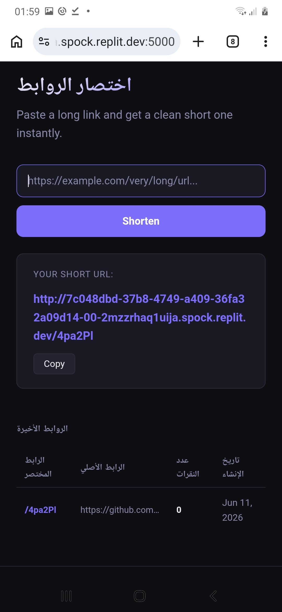

# ✂️ URL Shortener

مشروع اختصار الروابط هو تطبيق ويب بسيط وفعال مبني باستخدام Python و Flask.

## 📸 صور توضيحية للمشروع

### واجهة التطبيق:
!https://developer.mozilla.org/en-US/docs/Web/HTML/Reference/Elements/input(Screenshot_20260612-015935_Chrome.jpg)

### النتيجة بعد الاختصار:

## 🛠️ التقنيات المستخدمة
- Python
- Flask
- Flask-SQLAlchemy
- HTML/CSS

